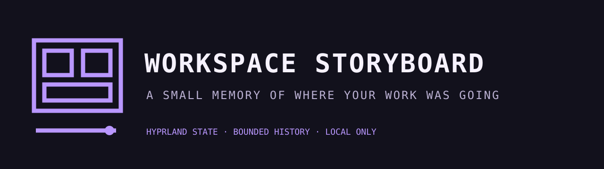

# Workspace Storyboard



[](https://ko-fi.com/U5S225PTME)

Workspace Storyboard turns the Omarchy bar into a visual map of where your work
is happening. It shows live Hyprland workspaces, their window counts, the active
window title, and a compact re-entry trail so returning to a project takes one
click instead of a memory test.

It reads local Hyprland JSON only. Every Hyprland response and final payload is
time and byte bounded. History is capped at 40 real transitions, suppresses
unchanged polling duplicates, and serializes concurrent writers beneath retained
state directory descriptors. Every workspace action revalidates a numeric ID.
When no Hyprland session is available it returns a valid empty state.

## Install

```bash
omarchy plugin add https://github.com/jeremylongshore/omarchy-workspace-storyboard-entry --enable
```

Click a workspace or recent entry to return to it. Keyboard users can use Up and
Down to select, Enter to jump, 1 through 9 to jump directly, and C to clear the
local re-entry trail.

## Privacy and removal

Workspace Storyboard never sends workspace data over the network. It retains at
most 40 workspace IDs, window titles, application classes, and timestamps in:

```text
$XDG_STATE_HOME/omarchy-workspace-storyboard/history.jsonl
```

When `XDG_STATE_HOME` is unset, the path is
`~/.local/state/omarchy-workspace-storyboard/history.jsonl`. The directory is
mode 0700 and the history and lock files are mode 0600. Use **Clear Local
History** in the panel, press C while the panel is open, or run:

```bash
bin/workspace-storyboard-history --clear
```

Removing the plugin does not silently remove user state. Delete the containing
`omarchy-workspace-storyboard` state directory if you also want to remove its
empty history and lock files.

## Verify

```bash
npm test
bash scripts/run-plugin-gates.sh
bash scripts/check-lane-freshness.sh
bash scripts/rig-verify.sh .
bash scripts/rig-render.sh . preview.png
```

The Buzz E2E lane loads the real plugin in the real Omarchy shell and opens it
through IPC. Because the shared container uses headless Sway rather than a live
Hyprland session, its scanner input and dispatch target are deterministic local
`hyprctl` fixtures. Unit and smoke tests separately exercise the documented
Hyprland JSON and fixed-argv dispatch contracts. The evidence does not claim a
live Hyprland compositor where one was not present.

## License

MIT
